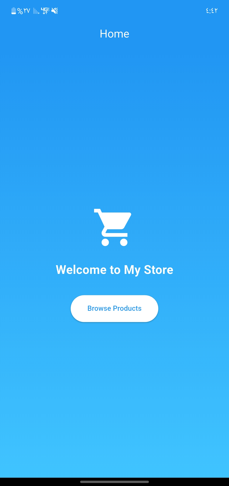
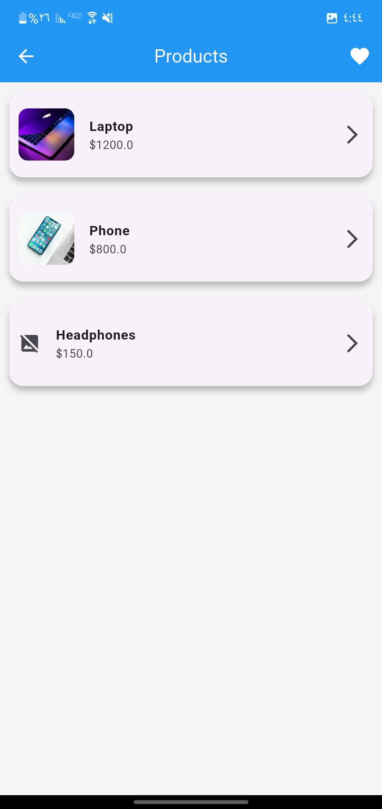
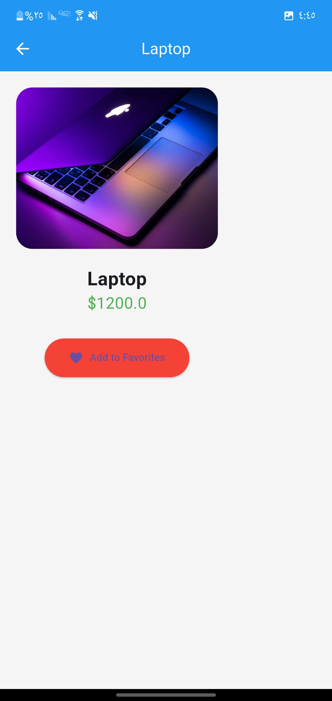
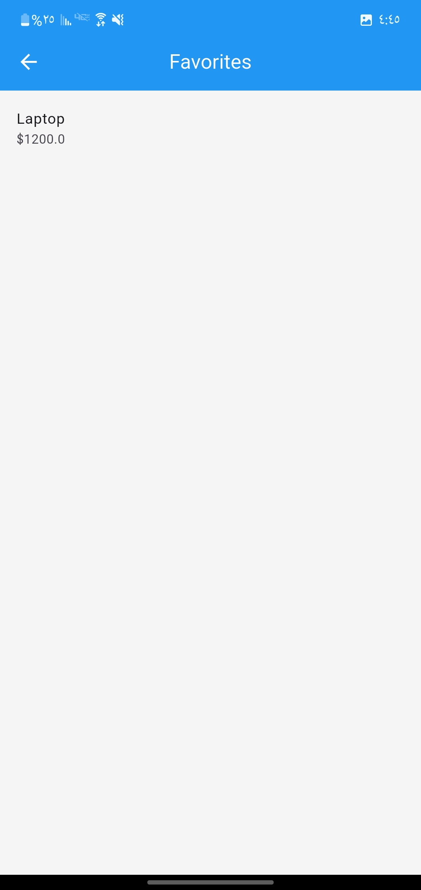
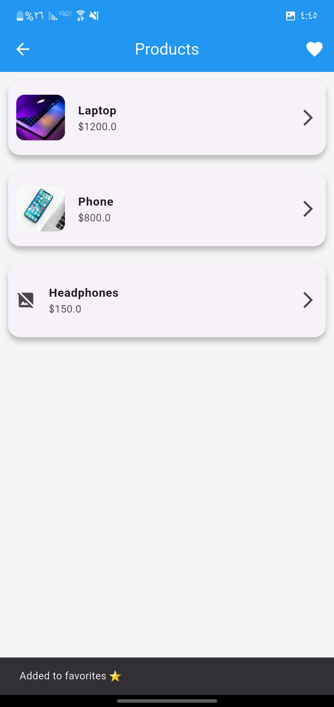

#####################
الوصف
#####################
هذا التطبيق هو مشروع مبني باستخدام Flutter يوضح أساسيات التنقل بين الشاشات (Navigation) وإدارة البيانات. يتيح للمستخدم تصفح قائمة من المنتجات، عرض تفاصيل كل منتج، وإضافته إلى المفضلة.
#####################
المميزات
#####################
التنقل بين الشاشات باستخدام Navigator
إرسال واستقبال البيانات بين الصفحات
عرض قائمة منتجات مع صور وأسعار
صفحة تفاصيل لكل منتج
إمكانية إضافة المنتجات إلى المفضلة
واجهة مستخدم بسيطة وجذابة
#####################
 معلومات المطور
#####################
الاسم: هلال بلال إبراهيم
الرقم الأكاديمي: 230102010039
#####################
الصور
#####################

